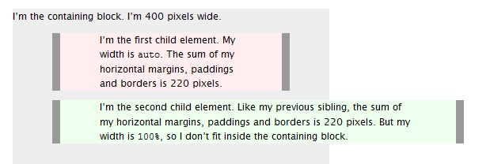

# width:auto vs. width:100%
Width auto

The initial width of a block level element like div or p is auto. This makes it expand to occupy all available horizontal space within its containing block. If it has any horizontal padding or border, the widths of those do not add to the total width of the element.

Width 100%

On the other hand, if you specify width:100%, the element’s total width will be 100% of its containing block plus any horizontal margin, padding and border (unless you’ve used box-sizing:border-box, in which case only margins are added to the 100% to change how its total width is calculated). This may be what you want, but most likely it isn’t.

To visualise the difference see this picture:

