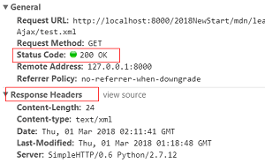
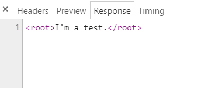

# Ajax
Asynchronous JavaScript + XML,异步JavaScript和XML。

简单来说，就是使用XMLHttpRequest对象与服务器通信。

其本身不是一种新技术，而是一个术语，用来描述一个使用现有技术集合的新方法。

这些技术包括：HTML or XHTML, Cascading Style Sheets, JavaScript, The Document Object Model, XML, XSLT, 以及最重要的 XMLHttpRequest object。

使用结合了这些技术的AJAX模型之后，网页程序能够快速地渐步更新呈现在用户界面上，而不需要重载整个页面。

# XMLHttpRequest
一个API，为客户端提供了在客户端和服务器之间传递数据的功能。

支持数据资源类型：All。
支持协议：HTTP、file、ftp。

构造函数：XMLHttpRequest()
继承关系：EventTarget <-- XMLHttpRequestEventTarget <-- XMLHttpRequest
## 属性
### readyState
<table>
    <tr>
        <th>属性</th>
        <th>类型</th>
        <th>描述</th>
    </tr>
    <tr>
        <th>readyState</th>
        <th>unsigned short</th>
        <th>
            <table>
                <tr>
                    <th>值</th>
                    <th>状态</th>
                    <th>描述</th>
                </tr>
                <tr>
                    <th>0</th>
                    <th>UNSENT(未打开)</th>
                    <th>open()方法未调用</th>
                </tr>
                <tr>
                    <th>1</th>
                    <th>OPENED(未发送)</th>
                    <th>open()方法已调用 send()方法未调用</th>
                </tr>
                <tr>
                    <th>2</th>
                    <th>HEADERS_RECEIVED(已获取响应头)</th>
                    <th>send()方法已调用 响应头和响应状态已经返回</th>
                </tr>
                <tr>
                    <th>3</th>
                    <th>LOADING(正在下载响应体)</th>
                    <th>响应体下载中 responseText中已经获取了部分数据</th>
                </tr>
                <tr>
                    <th>4</th>
                    <th>DONE(请求完成)</th>
                    <th>整个请求过程已经完毕</th>
                </tr>
            </table> 
        </th>
    </tr>
    <tr>
        <th></th>
        <th></th>
        <th></th>
    </tr>
    <tr>
        <th></th>
        <th></th>
        <th></th>
    </tr>
</table> 
2

4

## 方法
### abort()
如果请求已经被发送，则立即中止请求。
### open()
>注意: 在一个已经激活的request下（已经调用open()或者openRequest()方法的request）再次调用这个方法相当于调用了abort（）方法。
- method
- url
- syncFlag(默认为true)
> 注意：如果为false，提示如下：Synchronous XMLHttpRequest on the main thread is deprecated because of its detrimental effects to the end user's experience. 
