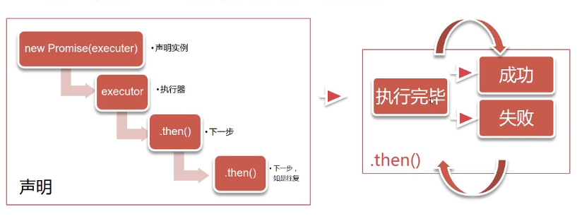

# Promise是什么
## 用途
- 用于异步计算
- 可以将异步操作队列华，按照期望的顺序执行，返回符合预期的结果
- 可以在对象之间传递和操作Promise，帮助我们处理队列

# Promise产生原因
## JavaScript包含大量异步操作
- JavaScript为检查表单而生
- 创造它的首要目标是操作DOM
- 所以，为了防止界面冻结，JavaScript的操作大多是异步的

## 异步操作的常见语法
### 事件侦听与响应
```js
document.getElementById('start').addEventListener('click', start, false);

function start(){}

$('#start').on('click', start);
```
### 回调
```js
//比较常见的ajax
$.ajax('http://baidu.com',{
    success: function(res){
        //回调函数
    }
});

//或者在页面加载完毕后回调
$(function(){
    //回调函数
})

```

## 浏览器中的JavaScript
- 异步操作以事件为主
- 回调主要出现在Ajax和File API
- 此场景中问题尚不算严重

## 有了nodejs之后
对异步的依赖进一步加剧
- 无阻塞高并发，是Node.js的招牌
- 异步操作是其保障
- 大量操作依赖回调函数

# 异步回调的四个问题
## 嵌套层次很深，难以维护
## 无法正常使用return和throw
## 无法正常检索堆栈信息
## 多个回调之间难以建立联系

# Promise简介
```js
new Promise(
    //执行器executor
    function(resolve, reject){
        //一段耗时很长的操作
        resolve();

        reject();
    }
).then(function A(){
    //成功的下一步
}, function B(){
    //失败的下一步
})
```

## Promise详解
- Promise是一个代理对象，它和原先要进行的操作并无关系。
- 它通过引入一个回调来避免更多的回调。
- 三个状态：
    - pending 待定，初始状态
    - fulfilled 实现，操作成功
    - rejected 被否决，操作失败
- Promise状态发生改变时，就会触发then中的响应函数进行后续处理。
- Promise状态一经改变，就不会再变。
- Promise实例已经创建，执行器立即执行。



# 简单范例
```js
//定时执行
console.log('Ready?Go!');
new Promise( resolve => {
    setTimeOut( () => {
        resolve('hello);
    }, 2000);
}).then( value => {
    console.log(value + ' world');
})

```

# .then()
- .then()接受两个函数作为参数，分别代表fulfilled和rejected
- .then()返回一个新的Promise实例，故可以链式调用
- 当前面的Promise状态改变时，.then()根据其最终状态，选择特定的状态响应函数执行
- 状态响应函数可以返回新的Promise，或者其他值
- 如果返回新的Promise，那么下一级.then()会在新Promise状态改变之后执行
- 如果返回其他任何值，则会立即执行下一级.then()
